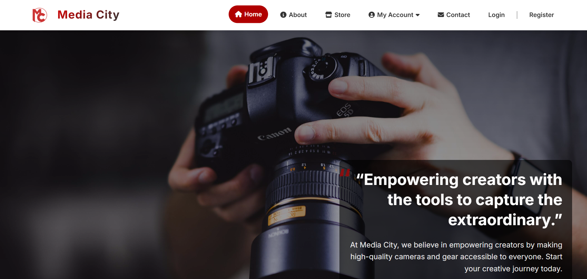

# 🎬 Media City — Creative Equipment Rental Platform

## 📌 Project Overview

**Media City** is a web platform prototype developed for a real client in Egypt's creative industry.

Founded in 2020, Media City aims to make professional production equipment more accessible to photographers, filmmakers, content creators, and other creative professionals.

The platform was designed to provide a modern, user-friendly experience for discovering and exploring professional photography and video equipment.

## 🎯 Project Objective

The objective of the project was to design and develop a modern digital platform that would:

- Showcase Media City's equipment and services
- Allow users to browse available equipment
- Organize products by category
- Present equipment with pricing and product information
- Provide an intuitive and responsive user experience
- Establish a professional online presence for the company

## ✨ Key Features

- 🎥 Equipment rental catalog
- 📷 Camera and lens categories
- 💡 Lighting equipment
- 🎬 Tripods and stabilizers
- 🔎 Product browsing
- 💰 Equipment pricing
- 🛒 E-commerce-style interface
- 👤 User account section
- 📱 Responsive web design
- 🎨 Modern creative interface
- 🧭 Structured navigation

## 🖥️ Website Sections

The platform includes several sections designed around the user's equipment-rental journey:

- Home
- About
- Store
- Equipment Categories
- Product Pages
- My Account
- Contact
- Login
- Registration

## 🛠️ Technologies

- HTML5
- CSS3
- JavaScript

## 📸 Project Preview

### Homepage

### Equipment & Categories

## 👩‍💻 My Role

I contributed to the design and development of the platform, including:

- Front-end development
- Website structure and layout
- User interface implementation
- Responsive design
- Equipment catalog presentation
- Navigation and user experience
- Integration of client requirements into the website prototype

## 🏢 Client Project

This project was developed as a website prototype for **Media City**, an Egyptian company operating in the creative equipment rental industry.

The project was presented to the client as a proposed digital platform and does not contain confidential client information.

## 🌍 About Media City

Media City was founded in 2020 with a vision to revolutionize equipment rental in Egypt's creative industry.

The company aims to bridge the gap between high-quality equipment and talented creators, making professional equipment more accessible to the creative community.

---

### 📌 Portfolio Project

This project demonstrates my experience in developing modern web platforms for real-world client requirements, with a focus on user experience, responsive design, and creative digital solutions.
